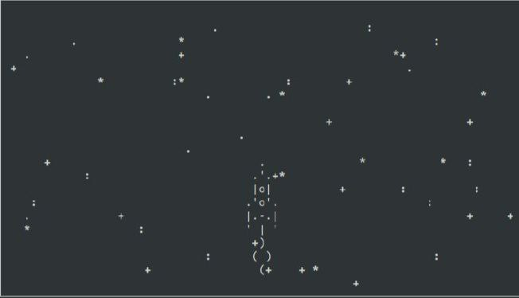

Это проект космической игры в консоли, управление боевым летающим кораблем в 
космосе.


## Управление

* Для управления кораблем используются стрелки.

* В планах , добавить реализацию выстрела нажатием на пробел.

## Установка

Используйте данную инструкцию по установке этого скрипта

1. Установить

```python
git clone https://github.com/Maxim-Pekov/async-cosmos-game.git
```

2. Создайте виртуальное окружение:

```python
python - m venv venv
```

3. Активируйте виртуальное окружение:

```python
.\venv\Scripts\activate`  # for Windows
```

```python
source ./.venv/bin/activate  # for Linux
```

4. Перейдите в `async-cosmos-game` директорию.

3. Установите зависимости командой ниже:

```python
pip install - r requirements.txt
```

4. Запустите сайт командой:

```python
python3 main.py
```


